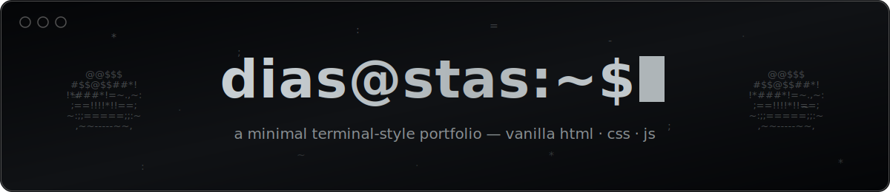

<p align="center">
  
</p>

A minimal, terminal-style portfolio site. Vanilla HTML, CSS and JavaScript — no frameworks, no build step, no dependencies.

## Features

- 🖥️ Terminal aesthetic — monospace type (JetBrains Mono), fake shell prompts (`$ whoami`, `$ ls ./projecten`), blinking block cursor
- ⌨️ Typed hero line with a typing animation
- 🍩 Animated ASCII donut rendered live in JavaScript (no images, no canvas)
- 🚀 Fake boot sequence on first visit (skipped on repeat visits via `sessionStorage`)
- 🎨 Buttons with a circular clip-path fill on hover
- 📱 Fully responsive, down to small phones
- ♿ Respects `prefers-reduced-motion` — animations are disabled or replaced with static frames
- ⚡ ~24KB total, zero external JavaScript

## Structure

```
.
├── index.html          # all content lives here
├── styles/
│   ├── normalize.css
│   └── style.css       # colors, layout, button transitions
└── scripts/
    ├── ascii.js        # spinning ASCII donut
    ├── boot.js         # boot screen on first visit
    └── type.js         # typed hero line
```

## Run locally

No build step — just open `index.html` in a browser, or serve the folder:

```bash
# python
python3 -m http.server 8000

# or node
npx serve .
```

Then visit `http://localhost:8000`.

## Customize

- **Projects** — edit the `<li class="project-entry">` blocks in `index.html`
- **About / skills** — the `#over` section in `index.html`
- **Colors** — the CSS variables at the top of `styles/style.css`:
  ```css
  :root {
      --grey: #AEB5B8;
      --black: #040507;
      --border: #525252;
  }
  ```
- **Typed hero text** — the `text` constant in `scripts/type.js`
- **Boot log lines** — the `lines` array in `scripts/boot.js`
- **Donut speed/size** — `width`, `height` and the interval in `scripts/ascii.js`

## Deploy

The site is static, so any static host works (GitHub Pages, Netlify, Vercel, Cloudflare Pages).

To serve it on a subdomain (e.g. `dev.example.com`):

1. Deploy the folder to your host
2. Add a `CNAME` record at your DNS provider pointing the subdomain to the host (e.g. `dev` → `username.github.io`)
3. Set the custom domain in your host's settings

## License

MIT — do whatever you want with it.

---

`©2026 dias stas` · [GitHub](https://github.com/ErrorNoSlash) · [Mastodon](https://mastodon.social/@slashy)
